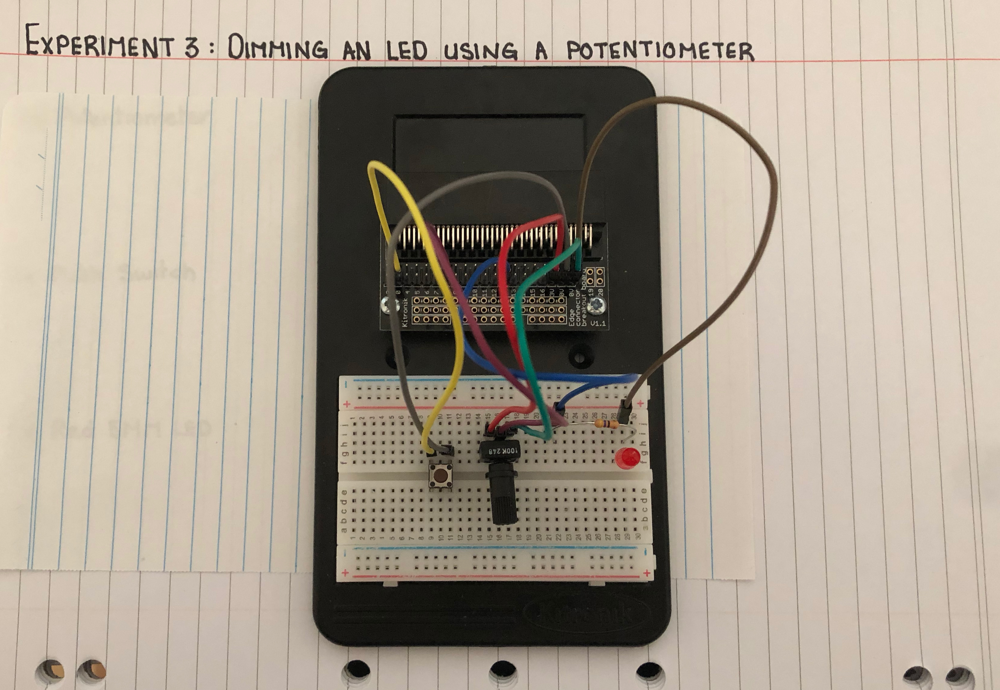
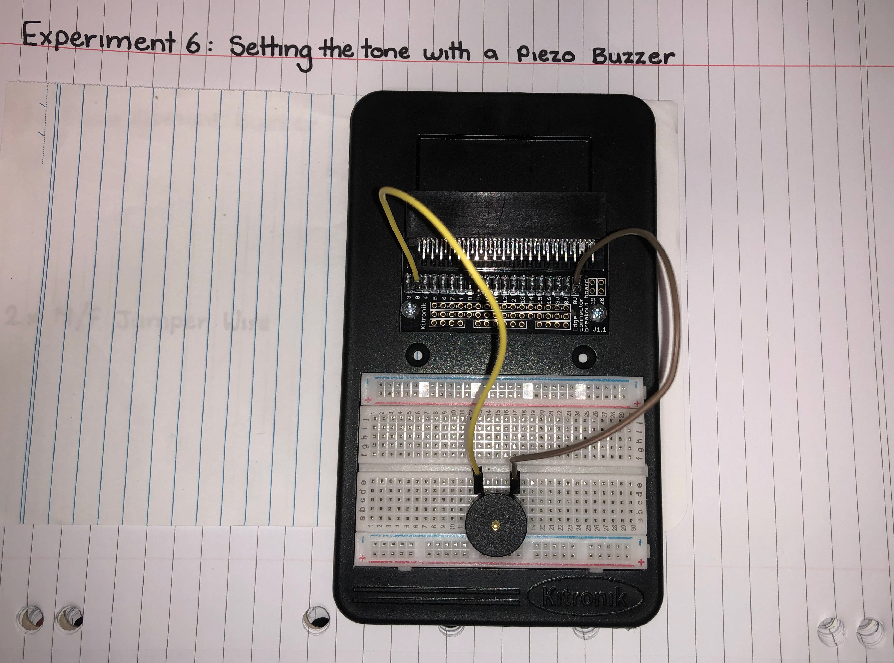
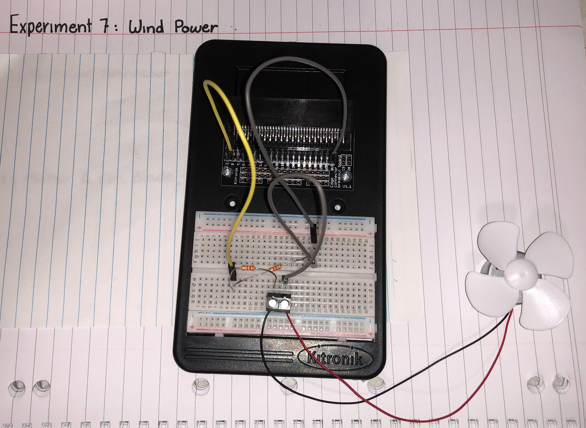
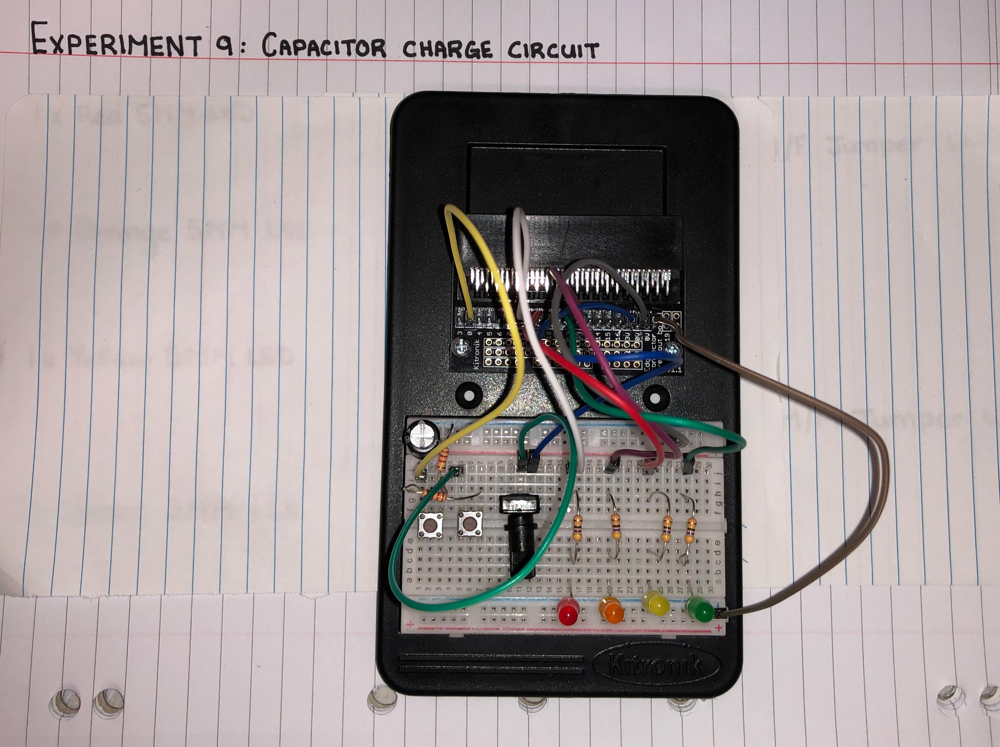

### Dimming an LED using a Potentiometer ###

In this experiment the goal was to be able to push the switch to turn the LED on and off. As well as use the Potentiometer to be able to dim the LED when it was on.

#### Photo of completed project ####

(Bread Board of completed wiring.)

#### Reflection ####

In this experiment, something new to me was or something I learned was the use of using a Potentiometer to dim a light, and the coding of two continueous loops. I learned that a Potentiometer controls the voltage that is given to the LED using a dial. As well as the two codes that are running simultaneously. One for when the push switch is pressed to turn on the light, and the other that controls the Potentiometer, whcih controls the brightness of the LED when the LED is on. The idea that is new is the idea of being able to code multiple loops and having them run at the same time.

This experiment could be the basis of a real world application such as the use of a internal lighting system in homes. The use of diming lights in a home works the same way in which a switch is turned on and the dial is used to detrmine the voltage that the LED is reading, which determines the brighthtness of the LED. 

### Using A Transistor to drive a Motor ###

In this experiment the transistor is turning on and off which controls the speed that motor is spinning.

#### Photo of completed project ####

(Completed Bread Board wiring)

#### Reflection ####

In this experiment, something new to me was or something I learned was the piece of equipment known as the Transistor. It was interesting to find out that the transisitor only uses a small amount of electrical current is used to operate the component which then allows a flow of current through. In the "Kitronik Inventor's Kit Tutorial Book" it was described as a gate that  the current from the micro:bit is used to open the gate and allow a large amount of current through. 

This experiment could be the basis of a real world application such as amplifying weak signals to run big machinary. THe transistor motor is used when there isnt enough power to run the equipment. SO this has the real world use of when a piece of machinary requires a lot of power, but only has a certain amount of power available a Transistor would be used to help run the machinary.

### Setting the Tone with a Piezo Buzzer ###

In this experiment the code tells the micro:bit when a button is pressed on the micro:bit to play a tune throug the buzzer.

#### Photo of completed project ####

(Wiring of completed project)

#### Reflection ####

In this experiment, something new to me was or something I learned was the use of using code to create a sound. The music blocks that were used create varying audio tones, these tones are then sent to Pin 0. When the button is pressed the programed amount of Hz or key will be played.

This experiment could be the basis of a real world application such as game buzzers. These buzzers work so that once pressed a certain sound is played. 

### Wind Power ###

This experiemt uses the spining of the fan motor to generate a voltage that can be measured.

#### Photo of completed project ####

(Completed Wiring of Bread Board)

#### Reflection ####

In this experiment, something new to me was or something I learned was the coding for Java Script, instead of Blocks. This was the first experiment that I had used Javascript coding for. I found that it was more difficult to create, but also easier to read. 

This experiment could be the basis of a real world application such as the use of wind turbines. Wind Turbines are besed on the idea of being able to use the kinetic energy in the wind and being able to convert it to a voltage that is usable.

### Capacitor Charge Circuit ###

This experiment uses a circuit to charge a capacitor to be charged through the Potentiometer. The micro:bit has been programmed to turn on the LED's at certain charge levels.

#### Photo of completed project ####

(Completed Bread Board)

#### Reflection ####

In this experiment, something new to me was or something I learned was the idea of charging a circuit using a capacitor and some kind of resistor. It was interesting

This experiment could be the basis of a real world application such as (insert something here).

