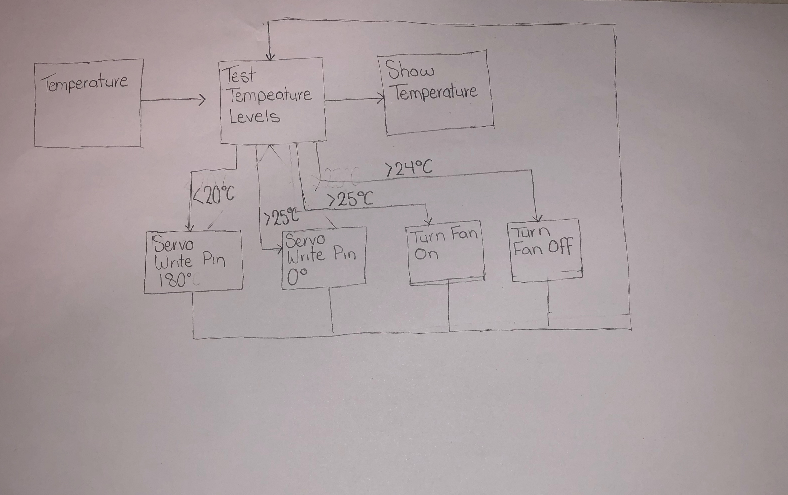

# Assessment 1: Replication project

## Replication project choice ##
Temperature Gauge

## Related projects ##
*Find about 6 related projects to the project you choose. A project might be related through  function, technology, materials, fabrication, concept, or code. Don't forget to place an image of the related project in the* `replicationproject` *folder and insert the filename in the appropriate places below. Copy the markdown block of code below for each project you are showing, updating the number* `1` *in the subtitle for each.*

### Related project 1 ###
(Insert name of project)

(Insert URL to project)

This project is related to mine because (insert reasons here).

## Reading reflections ##
*Reflective reading is an important part of actually making your reading worthwhile. Don't just read the words to understand what they say: read to see how the ideas in the text fit with and potentially change your existing knowledge and maybe even conceptual frameworks. We assume you can basically figure out what the readings mean, but the more important process is to understand how that changes what you think, particularly in the context of your project.*

*For each of the assigned readings, answer the questions below.*

### Reading: Don Norman, The Design of Everyday Things, Chapter 1 (The Psychopathology of Everyday Things) ###

*What I thought before: Describe something that you thought or believed before you read the source that was challenged by the reading.*

*What I learned: Describe what you now know or believe as a result of the reading. Don't just describe the reading: write about what changed in YOUR knowledge.*

*What I would like to know more about: Describe or write a question about something that you would be interested in knowing more about.*

*How this relates to the project I am working on: Describe the connection between the ideas in the reading and one of your current projects or how ideas in the reading could be used to improve your project.*

### Reading: Chapter 1 of Dan Saffer, Microinteractions: Designing with Details, Chapter 1 ###

*What I thought before: Describe something that you thought or believed before you read the source that was challenged by the reading.*

*What I learned: Describe what you now know or believe as a result of the reading. Don't just describe the reading: write about what changed in YOUR knowledge.*

*What I would like to know more about: Describe or write a question about something that you would be interested in knowing more about.*

*How this relates to the project I am working on: Describe the connection between the ideas in the reading and one of your current projects or how ideas in the reading could be used to improve your project.*

### Reading: Scott Sullivan, Prototyping Interactive Objects ###

*What I thought before: Describe something that you thought or believed before you read the source that was challenged by the reading.*

*What I learned: Describe what you now know or believe as a result of the reading. Don't just describe the reading: write about what changed in YOUR knowledge.*

*What I would like to know more about: Describe or write a question about something that you would be interested in knowing more about.*

*How this relates to the project I am working on: Describe the connection between the ideas in the reading and one of your current projects or how ideas in the reading could be used to improve your project.*

## Interaction flowchart ##

## Process documentation ##

### Concept ###

Out of the ideas presented I found that the temperature gauge most intersting and engaging to me. It was due to the fcat that the program had the ability to be used in everyday life, instead of just once or twice. 

From there i looked at how i want the gauge to be used and presented. It had to be portable and multifunctional where possible as well a suitable size so that it could contain the micro:bit and wires without appearing messy.

I also wanted it to be a suitable shape and colour so that it could have a modern contempary style

##### Souce for Temperature Gauge #####
https://www.hackster.io/anish78/how-to-create-temperature-gauge-using-micro-bit-a601cc

### Stage 1: Research ###

### Stage 2: Coding ###

### Stage 3: Building ###

### Stage 4: Intergration ###

The 
*In this section, include text and images that represent the development of your project including sources you've found (URLs and written references), choices you've made, sketches you've done, iterations completed, materials you've investigated, and code samples. Use the markdown reference for help in formatting the material.*

*This should have quite a lot of information!*

*There will likely by a dozen or so images of the project under construction. The images should help explain why you've made the choices you've made as well as what you have done. Use the code below to include images, and copy it for each image, updating the information for each.*

*Include screenshots of the code you have used.*

## Project outcome ##

### Temperature Gauge with Fan ###

### Project description ###

A temperature gauge that has been designed into a portable and multifunctional box that also includes a fan that turns on when above 24°vCelcius and off once it drops down past 25° Celcius.

### Showcase image ###

### Additional view ###

*Provide some other image that gives a viewer a different perspective on the project such as more about how it functions, the project in use, or something else.*

### Reflection ###

In this project the parts that were most successful was the abling the fan to turn on an doff when certain temperatures were reached. Another aspect that performed well was the visualisation of thge temperature on the BBC Micro:Bit. I found that while coding for this project I understood it fairly well. When challenges were presented i was able to successfully look back at past work and experiments performed and deduce what was wrong and how to fix it. One situation was that the fan was not turning off after it has reached the desired temperature. I was able to deduce from Experiment 4 that i had not put in the code that makes it turn off.

One component that couldve been greatly improved was the overall design of the box, and the readings on the gauge. Upon researching and preparing all the equipmnet i failed to factor in that the motor doeshave have a long shaft and as such the project board i had used for the box was to thick. As the components had already been glued together i was unable to replace it, so I used a stanley knife and removed the excess board. This created an unsmooth and rough surface on the front of the box. A consequence of this was that the triangles which were cut out were too high and the arrow struggled to clear them without geting caught. This caused the servo motor to become unsequared and spin on an axis thus throwing off the readings.

The most challenging obstacle that occured through this process was that i found that my wires were fraying and therefore my project stopped operating. One in particular was the fan wiring, after some time and a through inspection i found that wires for the red wire for the fan was fraying leaving only the plastic insulation exposed, i therefore had to cut away some of the plastic so that the wiring was exposed once more. I found this particulary challenging baceuse I was inexperienced in how to remove the insulation. I had got some instructions on how to proceed from the Course Convener David Harris. I had to repeat this task multiple times. I was unable to figure out why the wires were fraying so severly.

*What techniques, approaches, skills, or information did you find useful from other sources (such as the related projects you identified earlier)?*

*What ideas have you read, heard, or seen that informed your thinking on this project? (Provide references.)*

An extension to this project that may be intersting is that instead of a fan have a buzzer that alerts the operator that something is getting to hot. This idea could be used in the kitchen or with operational equipment. 

Another idea is that a motorised water sprayer is attached so once again if it get to hot, it starts spraying water at the operator. This could be used as a game istead of a traditional temperature gauge.

