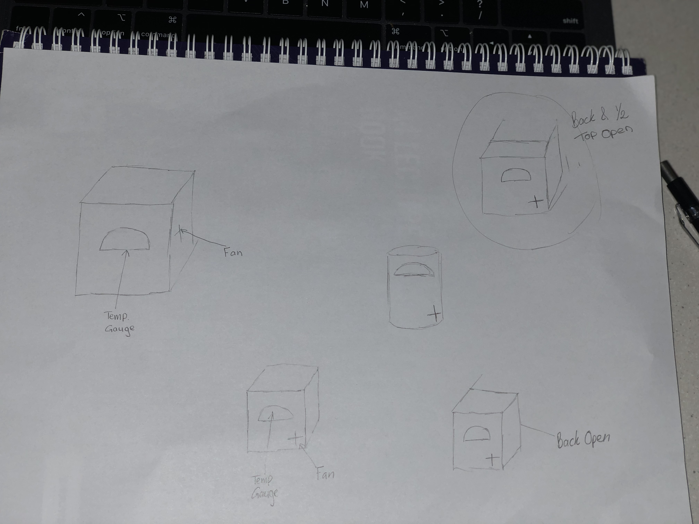
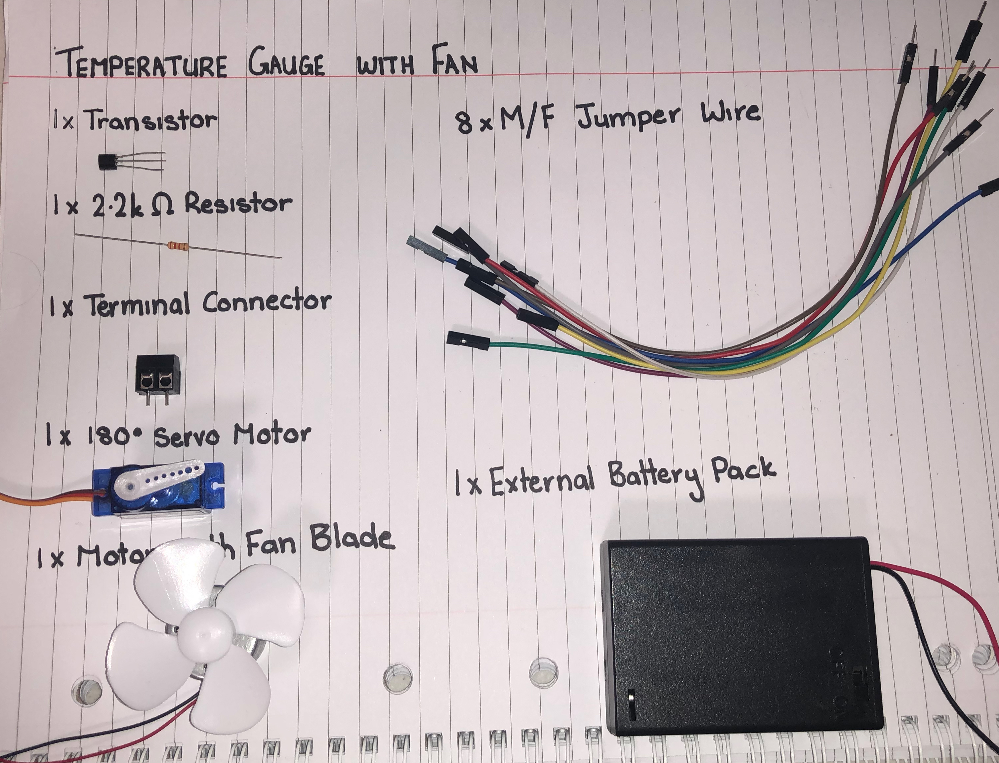
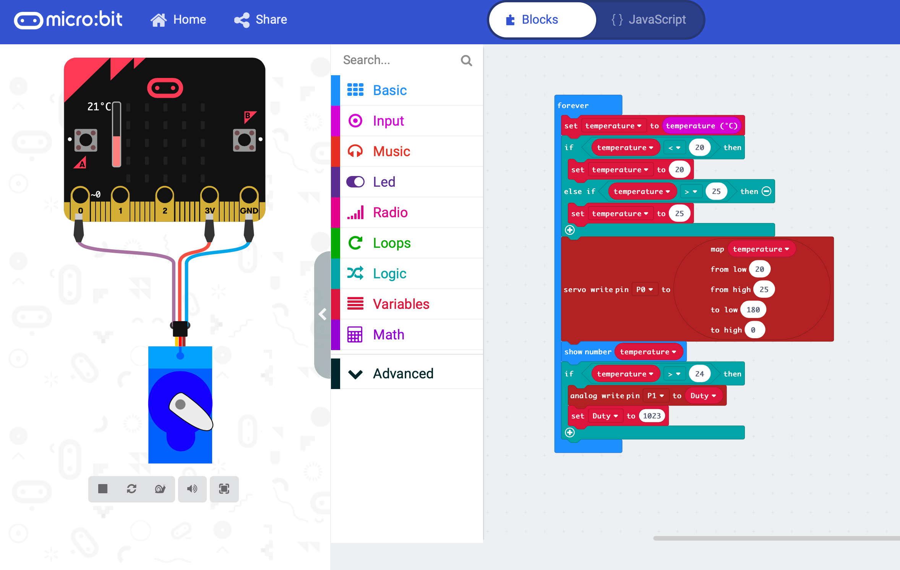
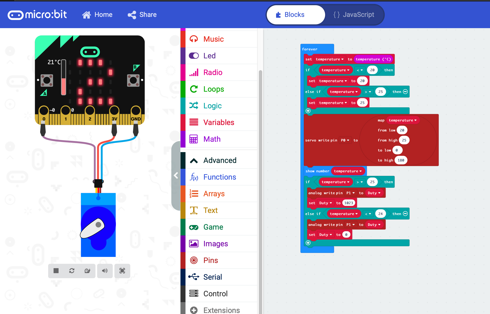
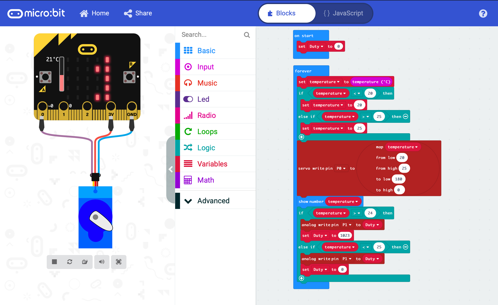
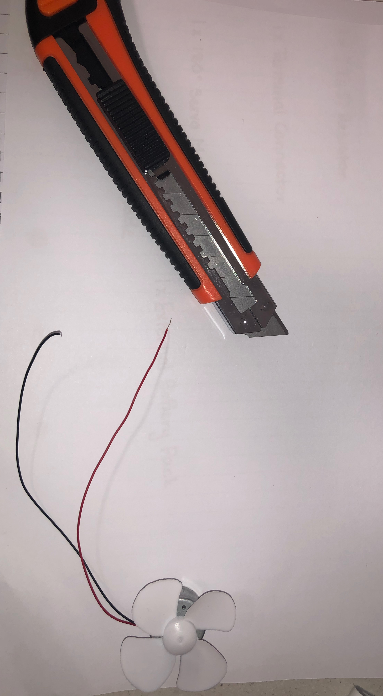
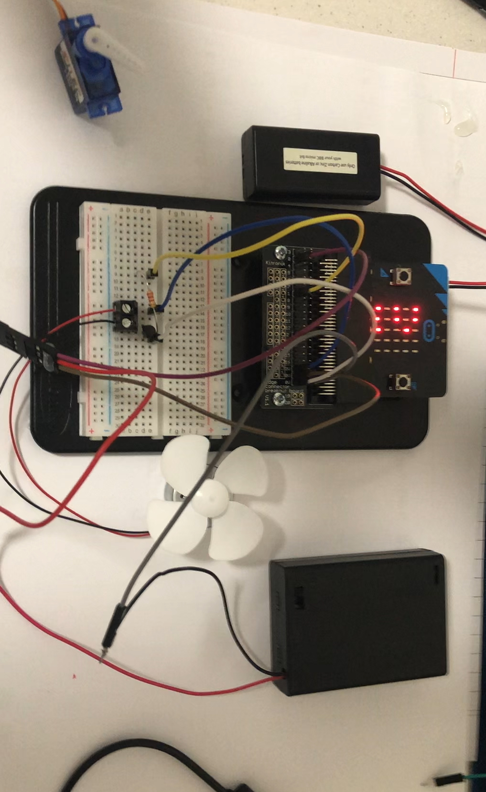
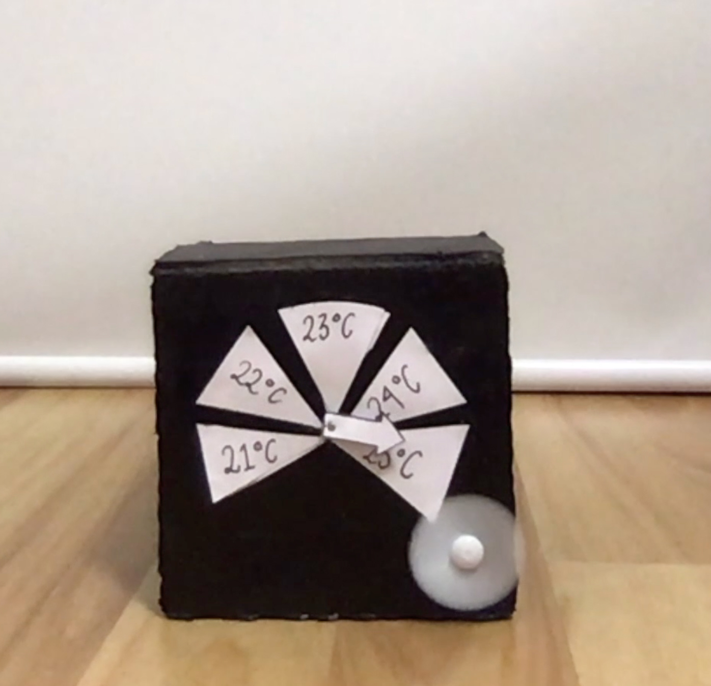
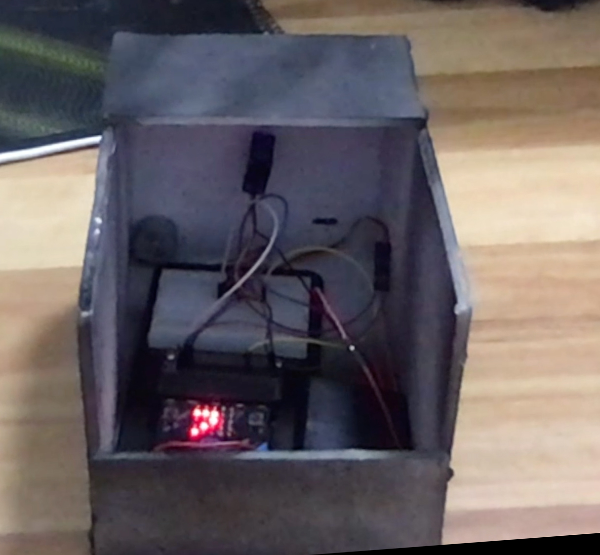

# Assessment 1: Replication project

## Replication project choice ##
Temperature Gauge

### Related Project 1 ###
(Insert name of project)

(Insert URL to project)

This project is related to mine because (insert reasons here).

### Related project 2 ###
(Insert name of project)

(Insert URL to project)

This project is related to mine because (insert reasons here).

### Related project 3 ###
(Insert name of project)

(Insert URL to project)

This project is related to mine because (insert reasons here).

### Related project 4 ###
(Insert name of project)

(Insert URL to project)

This project is related to mine because (insert reasons here).

### Related project 5 ###
(Insert name of project)

(Insert URL to project)

This project is related to mine because (insert reasons here).

### Related project 6 ###
(Insert name of project)

(Insert URL to project)

This project is related to mine because (insert reasons here).

## Reading reflections ##
*Reflective reading is an important part of actually making your reading worthwhile. Don't just read the words to understand what they say: read to see how the ideas in the text fit with and potentially change your existing knowledge and maybe even conceptual frameworks. We assume you can basically figure out what the readings mean, but the more important process is to understand how that changes what you think, particularly in the context of your project.*

*For each of the assigned readings, answer the questions below.*

### Reading: Don Norman, The Design of Everyday Things, Chapter 1 (The Psychopathology of Everyday Things) ###

*What I thought before: Describe something that you thought or believed before you read the source that was challenged by the reading.*

*What I learned: Describe what you now know or believe as a result of the reading. Don't just describe the reading: write about what changed in YOUR knowledge.*

*What I would like to know more about: Describe or write a question about something that you would be interested in knowing more about.*

*How this relates to the project I am working on: Describe the connection between the ideas in the reading and one of your current projects or how ideas in the reading could be used to improve your project.*

### Reading: Chapter 1 of Dan Saffer, Microinteractions: Designing with Details, Chapter 1 ###

*What I thought before: Describe something that you thought or believed before you read the source that was challenged by the reading.*

*What I learned: Describe what you now know or believe as a result of the reading. Don't just describe the reading: write about what changed in YOUR knowledge.*

*What I would like to know more about: Describe or write a question about something that you would be interested in knowing more about.*

*How this relates to the project I am working on: Describe the connection between the ideas in the reading and one of your current projects or how ideas in the reading could be used to improve your project.*

### Reading: Scott Sullivan, Prototyping Interactive Objects ###

*What I thought before: Describe something that you thought or believed before you read the source that was challenged by the reading.*

*What I learned: Describe what you now know or believe as a result of the reading. Don't just describe the reading: write about what changed in YOUR knowledge.*

*What I would like to know more about: Describe or write a question about something that you would be interested in knowing more about.*

*How this relates to the project I am working on: Describe the connection between the ideas in the reading and one of your current projects or how ideas in the reading could be used to improve your project.*

## Interaction flowchart ##

## Process documentation ##

### Concept ###

Out of the ideas presented I found that the temperature gauge most intersting and engaging to me. It was due to the fcat that the program had the ability to be used in everyday life, instead of just once or twice. 

From there i looked at how i want the gauge to be used and presented. It had to be portable and multifunctional where possible as well a suitable size so that it could contain the micro:bit and wires without appearing messy.

I also wanted it to be a suitable shape and colour so that it could have a modern contempary style.

I wanted to originally try differnt shapes but found that it would be too dificult to recreate, i also experiemented with palcement of the fan. Another factor that came in was the accessibility to the micro:bit, was it easily accessed, if i needed to reprogram it or the battery had to be changed. These metigating factor made me come up with a simple Black box that had 3/4 of the top removed and 1/2 of the back removed.

##### Souce for Temperature Gauge #####
https://www.hackster.io/anish78/how-to-create-temperature-gauge-using-micro-bit-a601cc

### Stage 1: Research ###

For the materials i was using i didn't do much research. Instead i made a list and went looking through department and craft and stationary stores such as Bunnings and Officeworks trying to find a suitable material to make the box out of. 

I cam across a white foam project board, that matched the charcateristics i was interested in. I wanted something that wouldn't be completely destroyed if placed in different environments, and it had to be durable and steady so it wouldnt bend or warp when objects are placeed on top of or against the container.

I choose a white piece of card for the physical gauge that would be glued down to the front of box.

(Equipmemt used in the electronic process)

### Stage 2: Coding ###

Originally i just simply copied the code from the site that ahd been supplied and tested if that worked using the digital version of the servo. After i had perfectef that code and got it operational i moved to making the varaiables more suited for the Brisbane environment. I choose to have the gauge run between 20° Celcius and 25° Celcius as those temperatures were the realistic in the environment. 

After that i went to another page and began the coding fo the fan. I used Experiment 4 from the Inventor Kit Tutorial book as aguide on how to code for the fan, just alternating some variabels with temperature.

With both codes working individually i placed them together.

With this code i found that while the fan was turning on at the desired temperature it wasnt turning off.

With additional block of code added the fan was turning off but it was later discovered while trying to configure the servo motor to turn in the right direction that the high and low point had to be cahnged so that it turned ant-clockwise instead of clockwise.

 

This is the code that was loaded up into the final presentation.

### Stage 3: Building ###

#### Electronical Wiring ####

To help in the wiring for the servo motor a website was supplied to show how the servo motor was to be connected to the micro:bit and where each wire had to be palced.

This information was sourced from: https://support.microbit.org/support/solutions/articles/19000101864-using-a-servo-with-the-micro-bit

Originally the Micro:bit wasnt going to be connected to a bread board, but after deliberation and thought it was decided that it would be easier and work better if all the component were connected via a bread board.

An issue found was that the wires connected to the servo motor kept coming lose, thus the servo motor lost power. A solution for was that i tenporary hot glued the three wires together so that they would stay correctly positioned if the container was jostled around.

It was also found that the wiring for the fan kept fraying away and therefore stopped the fan from opertaing. This was resolved by the stripping the plastic insulation around from around the wire so that more wire was exposed and allowed the fan to keep being operational.

(Final wiring for project)

#### Physical Container ####

I measured out all the squares and rectangles invloved in the process of making the container using a ruler then cut them out usinhg a Stanley Knife. 

These pieces were then hot glued together till the container formed. After this process the box was painted with two coats of black spray paint.

### Stage 4: Intergration ### 

Once all components were individually completed, the wiring was placed inside the box. The position where the servo motor would come through was measured so that it was in the middle and a whold was placed using a screw driver. It was at this point that it was discovered that the shaft the servo motor was to short to fit through the foam. Therefore using a stanley knife the excess foam was sahven away so that the servo could proparly connect to the arrow. The front of the container was repainted. 

The wedges that contained the measurements of temperature were added around the arrow. Due to the removal of foam regualr glue no longer worked on the surafce therefore this was substituted for hotglue. This had a consequence that it made the card uneven and made it rise from the box, this cause the arrow to have little clearance nad it sometimes struggled to get over these spots.

## Project outcome ##

### Temperature Gauge with Fan ###

### Project description ###

A temperature gauge that has been designed into a portable and multifunctional box that also includes a fan that turns on when above 24°vCelcius and off once it drops down past 25° Celcius.

### Showcase image ###

### Additional view ###

### Reflection ###

In this project the parts that were most successful was the abling the fan to turn on an doff when certain temperatures were reached. Another aspect that performed well was the visualisation of thge temperature on the BBC Micro:Bit. I found that while coding for this project I understood it fairly well. When challenges were presented i was able to successfully look back at past work and experiments performed and deduce what was wrong and how to fix it. One situation was that the fan was not turning off after it has reached the desired temperature. I was able to deduce from Experiment 4 that i had not put in the code that makes it turn off.

One component that couldve been greatly improved was the overall design of the box, and the readings on the gauge. Upon researching and preparing all the equipmnet i failed to factor in that the motor doeshave have a long shaft and as such the project board i had used for the box was to thick. As the components had already been glued together i was unable to replace it, so I used a stanley knife and removed the excess board. This created an unsmooth and rough surface on the front of the box. A consequence of this was that the triangles which were cut out were too high and the arrow struggled to clear them without geting caught. This caused the servo motor to become unsequared and spin on an axis thus throwing off the readings.

The most challenging obstacle that occured through this process was that i found that my wires were fraying and therefore my project stopped operating. One in particular was the fan wiring, after some time and a through inspection i found that wires for the red wire for the fan was fraying leaving only the plastic insulation exposed, i therefore had to cut away some of the plastic so that the wiring was exposed once more. I found this particulary challenging baceuse I was inexperienced in how to remove the insulation. I had got some instructions on how to proceed from the Course Convener David Harris. I had to repeat this task multiple times. I was unable to figure out why the wires were fraying so severly.

*What techniques, approaches, skills, or information did you find useful from other sources (such as the related projects you identified earlier)?*

*What ideas have you read, heard, or seen that informed your thinking on this project? (Provide references.)*

An extension to this project that may be intersting is that instead of a fan have a buzzer that alerts the operator that something is getting to hot. This idea could be used in the kitchen or with operational equipment. 

Another idea is that a motorised water sprayer is attached so once again if it get to hot, it starts spraying water at the operator. This could be used as a game istead of a traditional temperature gauge.

