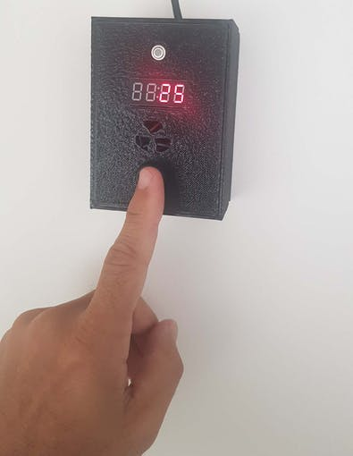
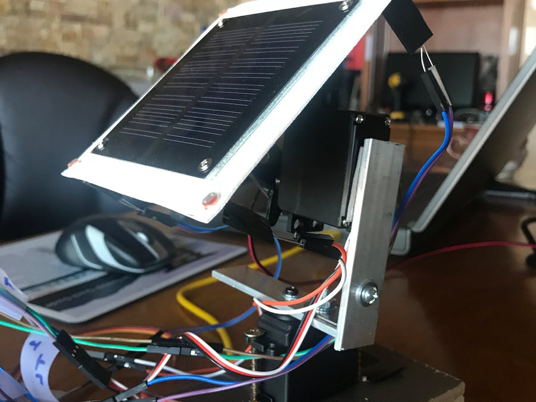
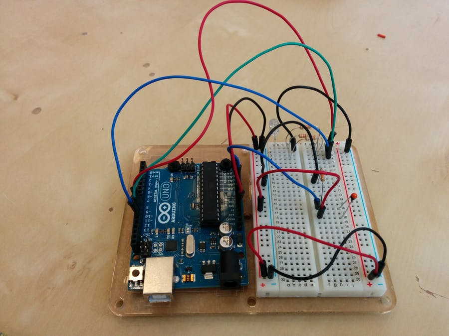
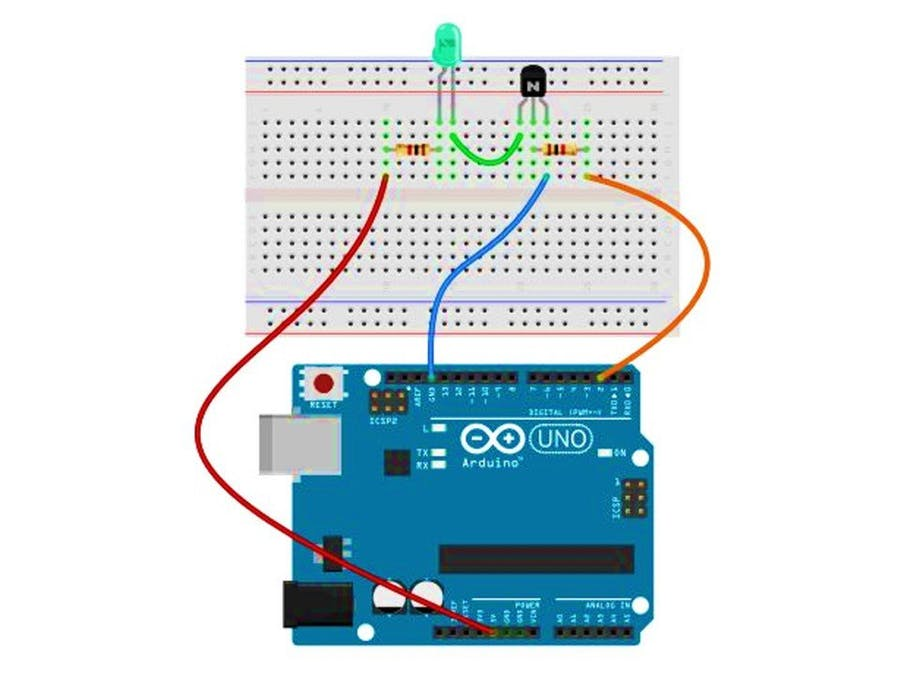
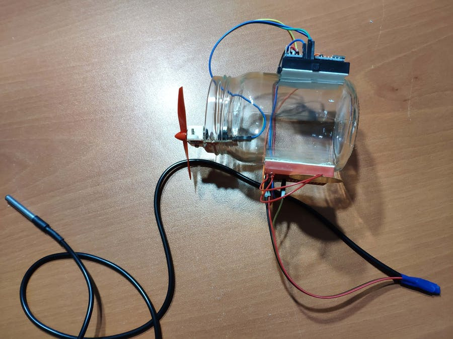
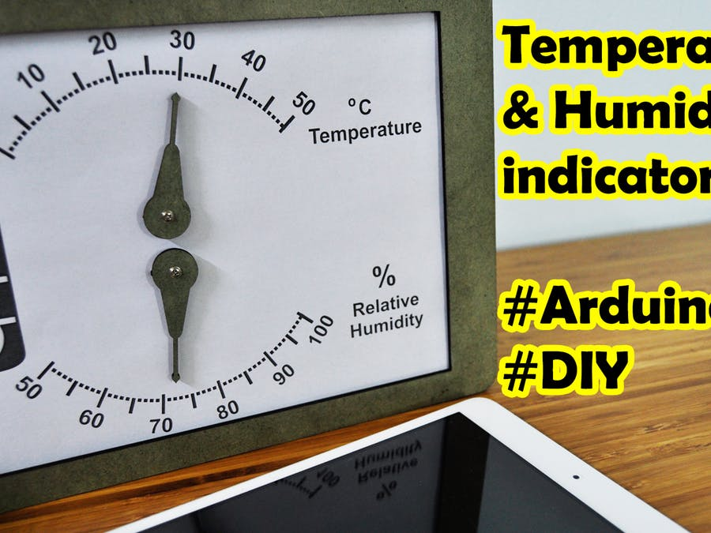
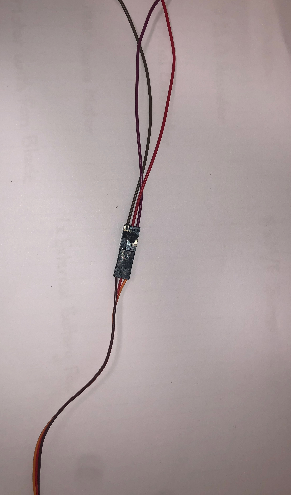
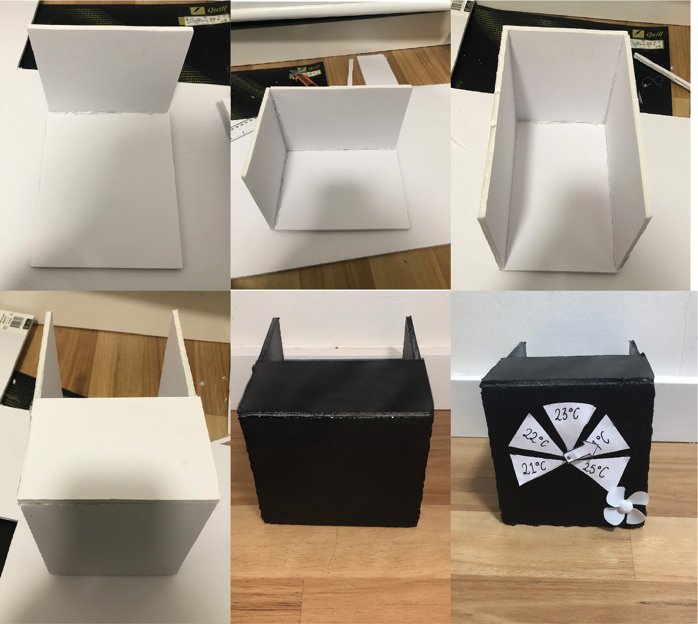

# Assessment 1: Replication project

## Replication project choice ##
Temperature Gauge

### Related Project 1 ###
Coronavirus Doorbell

(https://create.arduino.cc/projecthub/roni-bandini/coronavirus-doorbell-114b3f?ref=tag&ref_id=temperature&offset=0)

This project is related to mine because it uses the concept of reading the temperature and causing a reaction becaus eof the temperature that was read. In this case it will either ring the door bell if the person arriving has no temperature or set off an alarm if they do

### Related project 2 ###
Servo-Controlled, Light-Tracking Solar Panel Platform

(https://create.arduino.cc/projecthub/mangia/servo-controlled-light-tracking-solar-panel-platform-d29fdc?ref=search&ref_id=servo%20motor&offset=1)

This project is related to mine because it is that the servo motor move because of an input. The servo motors in the temperature gauge move because of the input it is reciveing from the temeprature, meanwhile in this project the servo moves becaue of the amount of sunlight the solar panels are recieveing. 

### Related project 3 ###
Temperature-controlled RGB LED

(https://create.arduino.cc/projecthub/ben/temperature-controlled-rgb-led-6c8cdf?ref=search&ref_id=temperature%20projects&offset=11)

This project project uses the temperature reading in a Micro:Bit to control whether the LED is blue or Red. This is simalar to my project as it is using the temperature to determine whether something moves or turns on, in the case LEDs.

### Related project 4 ###
Switching Using Transistor

(https://create.arduino.cc/projecthub/SBR/switching-using-transistor-c9114a?ref=search&ref_id=transistor%20projects&offset=2)

This project is related to mine as they use the resistor to determin the flow of the current. This case was to turn a light switch on and off istead of a fan which was what is was used for in the temperature gauge project.

### Related project 5 ###
Jar Temperature Detector and Cooling Fan

(https://create.arduino.cc/projecthub/kutluhan-aktar/jar-temperature-detector-and-cooling-fan-bc07c4?ref=search&ref_id=motor%20fan&offset=5)

This project is related to mine as it uses a simialr concept of when the temperature get above a certain threshold the fan will then turn on. This is differnt to mine as when the fan turns on it cools down what was getting to hot, in this case a jar.

### Related project 6 ###
Temperature and Humidity Indicator

(https://create.arduino.cc/projecthub/whitebank/temperature-and-humidity-indicator-by-arduino-2005a5?ref=search&ref_id=motor%20fan&offset=42)

This project is related to mine because this project uses information reacieved from a temperature and humidity sensor and uses this information to turn servo motors to the correct positions.

## Reading reflections ##

### Reading: Don Norman, The Design of Everyday Things, Chapter 1 (The Psychopathology of Everyday Things) ###

Before the reading I didnt understand what affordances or signifiers were. I also didn't understand whay certain items were designed as they were.

I leaned throughout this reading that affordances are the relationship between and person and and physical object and a signfiers are instruction on how to use an object. I learnt that there are differnt typoes of signifyers that go from text to a handle or even what material something is made from.

I would like to know more about the design process used when figuring out how to make these improvements.

This relates to the project i am working on as it explains how a signifier can be used to tell the person how to interact with object (affordance). 

### Reading: Chapter 1 of Dan Saffer, Microinteractions: Designing with Details, Chapter 1 ###

Before reading this article I had no idea what microinteractions were, and if I would've heard of them I would've thought they were some simple code that wouldn't matter if removed. 

What I learned through this reading is that microinteractions have a big impact on how a webpage or app is reacted to. For example when we set a twitter password, and the coloured word comes up next to what has been typed, it impacts the way we set our passwords as well as overall security on the site.

I would like to learn more about the many uses that Microinteractions have, and how to make an effective one.

This relates to my project because microinteractions are about the small details in the code and how it affects the user. A small detail in the code I created for this product was that the fan turns on and off certain temperature points so that the fan isn't running when it is already cool.

### Reading: Scott Sullivan, Prototyping Interactive Objects ###

Before reading this article I had the misconception that developers and designers were to very different fields of work. One physical and one technical. This article challenges this view as it explained the need for designers to be able to develop code as this opens a new avenue of projects to be created.

I learned throughout this reading that at the time you can have enormous amounts of success and fail on the tiny things, as well as that it's alright to be nervous to try a prototype out, sometimes you just have to give it a shot. Scott Sullivan likened it as getting punched in the face once it happens once it not so bad anymore. Once you've tried something or not as hard to try it again.

Another thing I learned is that the prototyping phase of development isn't as instantaneous i once thought, instead I realised that many different prototypes are required before the designer can reach a final product, but even then it can usually be further developed.

I would like to learn more about the online tools Processing and Arduino. I want to know about these programs as I hadn't realised programs used interactions to helped learn to code. I'm also interested in how they work to teach coding.

This is similar to my project as I had never prototyped or coded before. I was nervous about how it was going to happen. But throughout the process, after I had failed I learned and got better and wasn't nervous anymore. I also found it similar as I found myself going through multiple stages of prototyping.

## Interaction flowchart ##

## Process documentation ##

### Concept ###

Out of the ideas presented I found that the temperature gauge most interesting and engaging to me. It was because the program could be used in everyday life, instead of just once or twice. 

From there I looked at how I want the gauge to be used and presented. It had to be portable and multifunctional where possible as well a suitable size so that it could contain the Micro:Bit and wires without appearing messy.

I also wanted it to be a suitable shape and colour so that it could have a modern contemporary style.

I wanted to originally try different shapes but found that it would be too difficult to recreate, I also experimented with the placement of the fan. Another factor that came in was the accessibility to the Micro:Bit, was it easily accessed if I needed to reprogram it or the battery had to be changed. These mitigating factors made me come up with a simple Black box that had 3/4 of the top removed and 1/2 of the back removed.

##### Souce for Temperature Gauge #####
https://www.hackster.io/anish78/how-to-create-temperature-gauge-using-micro-bit-a601cc

### Stage 1: Research ###

For the materials, I was using I didn't do much research. Instead, I made a list and went looking through department and craft and stationery stores such as Bunnings and Officeworks trying to find a suitable material to make the box out of. 

I came across a white foam project board, that matched the characteristics i was interested in. I wanted something that wouldn't be destroyed if placed in different environments, and it had to be durable and steady so it wouldn't bend or warp when objects are placed on top of or against the container.

I choose a white piece of card for the physical gauge that would be glued down to the front of the box.

(Equipment used in the electronic process)

### Stage 2: Coding ###

Originally I just simply copied the code from the site that and been supplied and tested if that worked using the digital version of the servo. After I had perfected that code and got it operational I moved to make the variables more suited for the Brisbane environment. I choose to have the gauge run between 20° Celcius and 25° Celcius as those temperatures were realistic in the environment. 

After that, I went to another page and began the coding fo the fan. I used Experiment 4 from the Inventor Kit Tutorial book as a guide on how to code for the fan, just alternating some variables with temperature.

With both codes working individually I placed them together.

With this code, I found that while the fan was turning on at the desired temperature it wasn't turning off.

With the additional block of code added the fan was turning off but it was later discovered while trying to configure the servo motor to turn in the right direction, the high and low points had to be changed so that it turned anti-clockwise instead of clockwise.

 

This is the code that was loaded up into the final presentation.

### Stage 3: Building ###

#### Electronical Wiring ####

To help in the wiring for the servo motor a website was supplied to show how the servo motor was to be connected to the Micro:Bit and where each wire had to be placed.

This information was sourced from https://support.microbit.org/support/solutions/articles/19000101864-using-a-servo-with-the-micro-bit

Originally the Micro:Bit wasn't going to be connected to a breadboard, but after deliberation and thought it was decided that it would be easier and work better if all the components were connected via a breadboard.

An issue found was that the wires connected to the servo motor kept coming to lose, thus the servo motor lost power. A solution was that I temporary hot glued the three wires together so that they would stay correctly positioned if the container was jostled around.

It was also found that the wiring for the fan kept fraying away and therefore stopped the fan from operating. This was resolved by stripping the plastic insulation around from around the wire so that more wire was exposed and allowed the fan to keep being operational.

(Final wiring for the project)

#### Physical Container ####

I measured out all the squares and rectangles involved in the process of making the container using a ruler then cut them out using a Stanley Knife. 

These pieces were then hot glued together so that the container formed. After this process, the box was painted with two coats of black spray paint.

### Stage 4: Intergration ### 

Once all components were individually completed, the wiring was placed inside the box. The position where the servo motor would come through was measured so that it was in the middle and a hole was placed using a screwdriver. It was at this point that it was discovered that the shaft the servo motor was to short to fit through the foam. Therefore using a Stanley knife the excess foam was shaven away so that the servo could properly connect to the arrow. The front of the container was repainted. 

The wedges that contained the measurements of temperature were added around the arrow. Due to the removal of foam regular glue no longer worked on the surface therefore this was substituted for hot glue. This had a consequence that it made the card uneven and made it rise from the box, this cause the arrow to have little clearance nad it sometimes struggled to get over these spots.

## Project outcome ##

### Temperature Gauge with Fan ###

### Project description ###

A temperature gauge that has been designed into a portable and multifunctional box that also includes a fan that turns on when above 24°vCelcius and off once it drops down past 25° Celcius.

### Showcase image ###

### Additional view ###

### Reflection ###

In this project, the most successful parts were the fan turning on and off when certain temperatures were reached. Another aspect that performed well was the visualisation of the temperature on the BBC Micro:Bit. I found that while coding for this project I understood it fairly well. When challenges were presented I was able to successfully look back at past work and experiments performed and deduce what was wrong and how to fix it. One situation was that the fan was not turning off after it has reached the desired temperature. I was able to deduce from Experiment 4 that I had not put in the code that makes it turn off.

One component that could've been greatly improved was the overall design of the box, and the readings on the gauge. Upon researching and preparing all the equipment I failed to factor in that the motor does have a long shaft and as such, the project board I had used for the box was to thick. As the components had already been glued together I was unable to replace it, so I used a Stanley knife and removed the excess board. This created an unsmooth and rough surface on the front of the box. A consequence of this was that the triangles which were cut out were too high and the arrow struggled to clear them without getting caught. This caused the servo motor to become unsecured and spin on an axis thus throwing off the readings.

The most challenging obstacle that occurred through this process was that I found that my wires were fraying and therefore my project stopped operating. One, in particular, was the fan wiring, after some time and thorough inspection I found that wires for the red wire for the fan were fraying leaving only the plastic insulation exposed, I, therefore, had to cut away some of the plastic so that the wiring was exposed once more. I found this particularly challenging because I was inexperienced in how to remove the insulation. I had got some instructions on how to proceed from the Course Convener David Harris. I had to repeat this task multiple times. I was unable to figure out why the wires were fraying so severely.

Appraches I found useful were looking at the code and breaking it down by using the Javascript reader. Ot allowed me to see any errors that oi may have accidently put in. A skill i picked up during this process was cross checking, a si found myself cross checking with previous experiments that had been completed.
*What techniques, approaches, skills, or information did you find useful from other sources (such as the related projects you identified earlier)?*

Ideas that I used throughout this process came from a variety of sources. One was the initial idea itself that as supplied to us. Another was a video on how to test and work the servo motor. 
https://www.youtube.com/watch?v=Hi3Km1PV45M&fbclid=IwAR3cV-a-43uknAsszY9pvXvyxRCkCJ8z2YA0YRKjcGfaiPtwINFPoIDtzX4
https://www.hackster.io/anish78/how-to-create-temperature-gauge-using-micro-bit-a601cc

An extension to this project that may be interesting is that instead of a fan have a buzzer that alerts the operator that something is getting to hot. This idea could be used in the kitchen or with operational equipment. 

Another idea is that a motorised water sprayer is attached so once again if it gets too hot, it starts spraying water at the operator. This could be used as a game instead of a traditional temperature gauge.

